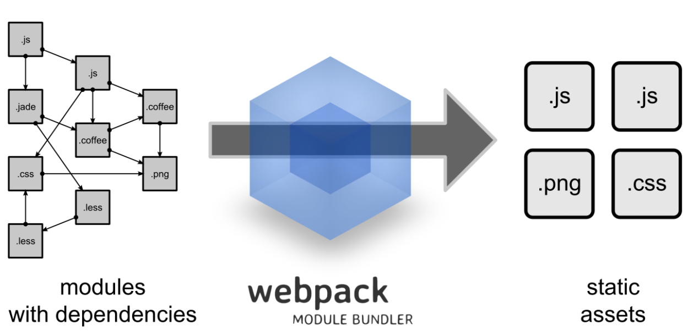
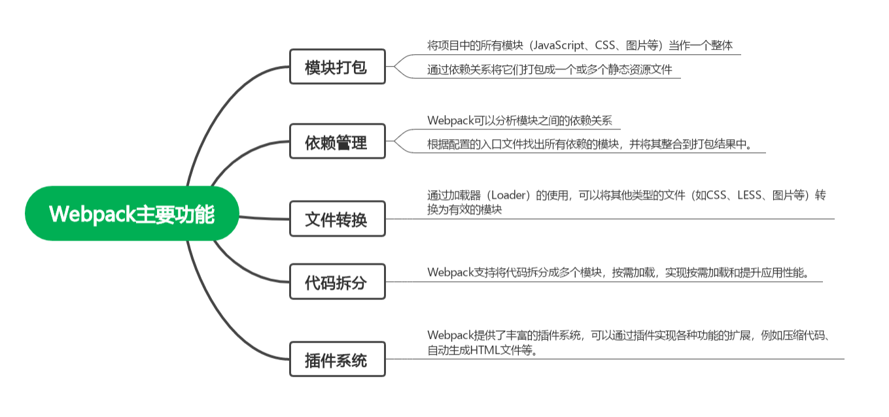

# caculator 项目复现笔记

vue2（vue@2.7.16）和 webpack5

## 快速启动

cd 到文件夹，配置好所需要的环境，然后启动。

```
# 一句命令启动
cd vue-calculator && npm install && npm run dev

cd
npm install
npm run dev
```

#### 访问地址：

http://localhost:5176/

```
npm run dev -- --port 5176
```

localhost = 127.0.0.1，表示本机（你的电脑）
只有你能访问，其他人无法通过网络访问

## 项目结构

```
vue-calculator/
├── index.html              # HTML 模板
├── package.json            # 项目配置和依赖
├── webpack.config.js       # Webpack 构建配置
├── .babelrc               # Babel 配置（可选）
├── node_modules/          # 依赖包
├── dist/                  # 构建输出目录
└── src/
    ├── main.js            # 应用入口
    ├── Calculator.vue     # 根组件
    └── components/
        └── CalculatorContent.vue  # 计算器核心组件
```

## 前提准备

1. 项目初始化
   创建新的文件夹并 cd 到，使用 npm（Node Package Manager）来初始化一个新项目。它会创建一个名为 package.json 的文件，这是所有 Node.js 和前端项目（包括 Vue 项目）的“身份证”和配置中心。

   ```
   mkdir vue-calculator && cd vue-calculator
   npm init -y
   ```

   输出结果： 会生成基础的 package.json，包含项目名称、版本等信息

2. 安装相关依赖
   下载过程会有点慢

   ```
   # 核心依赖（生产环境）
   npm install vue@^2.1.0

   # 开发依赖（开发环境）
   npm install --save-dev webpack@^2.1.0-beta.25 webpack-dev-server@^2.1.0-beta.9 vue-loader@^10.0.0 vue-template-compiler@^2.1.0 babel-core@^6.0.0 babel-loader@^6.0.0 babel-preset-es2015@^6.0.0 css-loader@^0.25.0 file-loader@^0.9.0 cross-env@^3.0.0

   ```

   验证安装：

   ```
   # 查看 Vue 版本
   npm list vue

   # 查看 Webpack 版本
   npm list webpack

   ```

## 核心配置解析

### 配置 package.json 文件

```
npm init -y  # 自动生成基础 package.json
```

安装相关依赖 👇

```
npm run dev
```

基础项目信息个性化

```
{
  "name": "your-project-name",        // 必须是唯一的包名
  "description": "Your description",   // 项目描述
  "author": "Your Name",              // 作者信息
  "version": "1.0.0"                 // 版本号
}
```

script 脚本部份（最常用）
(实际项目中并没有使用到这么多)

```
{
  "scripts": {
    "dev": "cross-env NODE_ENV=development webpack serve --mode development --open",
    "build": "cross-env NODE_ENV=production webpack --mode production",
    "build:analyze": "cross-env NODE_ENV=production webpack --mode production --analyze",
    "preview": "http-server dist -p 5176",
    "clean": "rm -rf dist",
    "start": "npm run dev"
  }
}

```

### 配置 webpack.config.js 文件

```
 npm init // 1.在空文件夹初始化package.json文件
 npm install webpack webpack-cli // 2.安装webpack以及webpack-cli依赖包

```

四个核心概念：

```
module.exports = {
  // 1. 入口：告诉 Webpack 从哪个文件开始打包
  entry: './src/main.js',

  // 2. 输出：告诉 Webpack 打包后放在哪里
  output: {
    path: __dirname + '/dist',
    filename: 'build.js'
  },

  // 3. 加载器：告诉 Webpack 如何处理不同文件类型
  module: {
    rules: [
      {
        test: /\.vue$/,
        loader: 'vue-loader'
      },
      {
        test: /\.js$/,
        loader: 'babel-loader',
        exclude: /node_modules/
      },
      {
        test: /\.css$/,
        use: ['style-loader', 'css-loader']
      }
    ]
  },

  // 4. 插件：扩展 Webpack 功能
  plugins: [
    new VueLoaderPlugin()
  ]
}
```

loader： 处理规则：

\*.vue 文件用 vue-loader

\*.js 文件用 babel-loader（转译 ES6）

\*.css 文件用 style-loader + css-loader

⚠️ ： 配置文件中不要乱用分号 ;，否则可能出现莫名其妙的语法错误

## Vue 组件详解

#### Vue 单文件组件结构

所有 .vue 文件都遵循这个三部分结构：

```
<template>
  <!-- HTML 结构 -->
  <div>{{ message }}</div>
</template>

<script>
  // JavaScript 逻辑
  export default {
    data() {
      return {
        message: 'Hello'
      }
    }
  }
</script>

<style>
  /* CSS 样式 */
  div {
    color: red;
  }
</style>
```

Template（模板）：UI 界面和事件绑定

Script（脚本）：业务逻辑和数据管理

Style（样式）：界面美化和布局

1. index.html 入口模版
   <div id="app"></div> 是 Vue 的挂载点

   Webpack 打包的 JavaScript 会自动注入

2. src/main.js 应用入口

   ```

   import Vue from 'vue'           // 导入 Vue 框架

   import App from './App.vue'     // 导入根组件
   new Vue({                       // 创建 Vue 实例
        el:'#app',                   // 挂载到 id="app" 的 DOM 元素
        render: h => h(App)           // 渲染 App 组件
   })

   ```

3. src/Calculator.vue 根组件

   components： 注册组件，使用组件时才需要

4. src/components/CalculatorContent.vue 核心组件

   Mustache 语法是用双大括号 {{ }} 来包裹变量的模板语法，用于在 HTML 中动态显示数据。

   ```
   {{ message }}
   ```

   v-cloak 用来防止 Vue 模板在加载前显示原始 Mustache 语法（{{变量}}）等内容。v-cloak 本身不会被 Vue 渲染成任何 DOM 元素属性。

   v-cloak 仅在 Vue 实例加载前起作用，加载后 Vue 会自动移除；必须配合 CSS 选择器才能生效。

   ```
   [v-cloak] { display: none; }
   ```

   如果没有这个 CSS，刷新页面时会看到 {{ formula }} 这样的原始文本

   模块化

   ```
   // 文件 A：导出
   export default { ... }

   // 文件 B：导入
   import Something from './A.vue'

   ```

## 复现项目是遇到的疑问以及解决

### 问题 1：vue-loader 版本不匹配

error：

```
Error: Cannot find module 'vue-loader'
或
vue-loader@17 requires Vue 3, but Vue 2 is installed
```

原因：

错误是因为你用的是 Vue 2.7.16，但装的 vue-loader 是 Vue 3 的版本.

```
Vue 2.7.16 → 需要 vue-loader@15
Vue 3.x → 需要 vue-loader@17
```

解决：

```
# 查看 Vue 版本
npm list vue

# 查看 vue-loader 版本
npm list vue-loader

# 如果不匹配，卸载并重新安装正确版本
npm uninstall vue-loader
npm install --save-dev vue-loader@15.x.x
```

### 问题 2:Webpack 打包失败

常见原因：

缺少 loader

路径错误

配置文件语法错误

解决：

```
# 检查配置文件语法
node -c webpack.config.js

# 清除缓存并重新构建
rm -rf dist node_modules
npm install
npm run build
```

### 问题 3：端口被占用

```
Error: listen EADDRINUSE: address already in use :::5176
```

解决：

```
# 方案1：使用其他端口(最迅速)
npm run dev -- --port 5177

# 方案2：杀死占用该端口的进程
# macOS/Linux
lsof -i :5176
kill -9 <PID>

# Windows
netstat -ano | findstr :5176
taskkill /PID <PID> /F
```

### 一些警告，不耽误运行

废弃包警告（Deprecated）

```
npm warn deprecated....
```

安全漏洞警告(中低级)

```
6 vulnerabilities (1 low, 5 moderate)
```

## webpack



功能：将项目中的多个模块打包成一个或多个静态资源文件，并提供了丰富的功能和插件系统来满足前端开发的需求。



核心概念：

entry：指定 Webpack 的入口文件

output：定义打包输出的文件及路径

loader：用于处理不同类型的文件

plugin：用于扩展 Webpack 的功能
